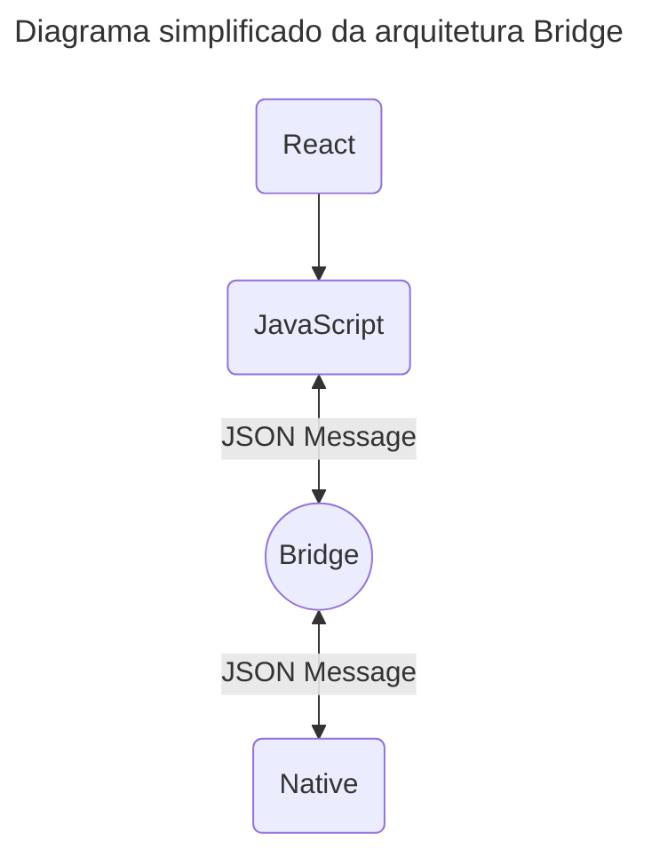
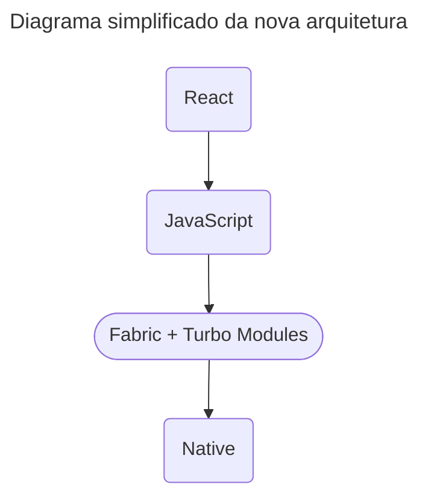

O React Native já faz parte do meu dia-a-dia há alguns anos, foi com ele que pude ter um primeiro contato com o mundo de desenvolvimento mobile. 

Hoje quero compartilhar um pouco sobre como o React Native funciona e como ele torna possível o desenvolvimento de aplicativos para Android e iOS.
## Estrutura
**“O React Native permite que os desenvolvedores que conhecem React criem aplicativos nativos.”** É assim que somos inicialmente apresentados a esse framework em umas das primeiras páginas da doc oficial: [Get Started with React Native](https://reactnative.dev/docs/environment-setup).

Muitas vezes, essa apresentação inicial do React Native como um framework para criar aplicativos nativos pode parecer confusa, pois ele na verdade **não gera nenhum código nativo**.

Pelo menos não diretamente... como faria um app escrito em Swift (iOS) ou Kotlin (Android). Em vez disso, ele usa uma ponte, a **Bridge**, para o código JavaScript conseguir se comunicar com as APIs e componentes nativos. 

Isso se torna mais claro ao compararmos com outros frameworks, como o Cordova e Ionic que rodam parte da interface do app em cima de uma WebView.

> “...WebView é um componente de software de grande escala que permite o uso de conteúdo web dentro de aplicativos...” - [Wikipedia](https://en.wikipedia.org/wiki/WebView)

Diferente deles, o React Native realmente utiliza elementos nativos para a interface do usuário. Isso significa que um `Text` no React Native se transforma em um `UITextView` no iOS e um `TextView` no Android.

| React Native | Android       | iOS             | Web     |
| ------------ | ------------- | --------------- | ------- |
| `<View>`     | `<ViewGroup>` | `<UIView>`      | `<div>` |
| `<Text>`     | `<TextView>`  | `<UITextView>`  | `<p>`   |
| `<Image>`    | `<ImageView>` | `<UIImageView>` | `` |

## Construindo interfaces
No React Native, **tudo é baseado em views**! Bem... digo, a construção da interface do usuário é toda baseada em views. 🎨

> Uma **view** é um bloco de UI usado para compor a tela, seja uma imagem, um texto ou um botão, todos são tipos de views.

Em desenvolvimento nativo, as views são escritas usando **Kotlin**/**Java** no Android e **Swift**/**Objective-C** no iOS. Já no React Native, essas views são criadas com **JSX** e, durante a execução, esses componentes React são convertidos para os equivalentes nativos no Android e no iOS.

```jsx
import React from 'react';
import { Text, View } from 'react-native';

const App = () => {
  return (
    <View
      style={{
        flex: 1,
        justifyContent: 'center',
        alignItems: 'center',
      }}
    >
      <Text>Salve!</Text>
    </View>
  );
};

export default App;
```

Se quiser entender um pouco mais sobre o uso do React no React Native, recomendo ler essa seção sobre [Fundamentos do React](https://reactnative.dev/docs/intro-react) lá na doc oficial.
## Arquitetura
Ali no começo eu falei brevemente sobre a **Bridge**, a primeira arquitetura do React Native. "Primeira", pois uma segunda e **nova arquitetura** já vem sendo desenvolvida desde 2018 pelo time do React Native.

> [React Native's New Architecture - Parashuram N - React Conf 2018](https://www.youtube.com/watch?v=UcqRXTriUVI)

Mas por que uma nova arquitetura? Qual o problema da Bridge? 🤔

Nessa arquitetura com a Bridge, o **JavaScript** e o lado **Nativo** não sabem realmente da existência um do outro, eles não tem uma **referência**. Para eles se comunicarem eles dependem das trocas de mensagens **JSON** assíncronas que são serializadas e desserializadas pela Bridge. Isso introduz uma camada assíncrona que tem impacto na performance em algumas situações.



Imagine o seguinte cenário:

📌 App com uma grande quantidade de dados para mostrar na tela.
📌 Diversos eventos.
📌 Múltiplas atualizações de estado em resposta desses eventos ocorrendo.

Em uma situação assim, a Bridge ira ficar sobrecarregada... 💣

Todo esse processo das trocas de mensagens JSON, serialização e desserialização dos dados irão gerar um "lag" na aplicação, fazendo aparecer, por exemplo, *flashes* de tela branca e *delays* na renderização de alguns itens durante esses processos.

<div style={{ textAlign: 'center', fontSize: 'var(--font-size-lg)' }}>🫠 . . .</div>

Para resolver isso, surge a **nova arquitetura**! 🎉

Nela, a Bridge é substituída pelo **Fabric**, um novo sistema de renderização do React Native que permite criar e manipular views diretamente na thread nativa, de forma mais eficiente.

Além disso, entram também os **Turbo Modules**, uma abordagem diferente para a interação com o lado nativo, permitindo que o JavaScript carregue módulos nativos apenas quando necessário.

Com essa nova arquitetura, o combo **Fabric** e **Turbo Modules** permitem que o **JavaScript** mantenha uma **referência direta** aos componentes e módulos nativos, reduzindo bastante a comunicação assíncrona da Bridge e melhorando significativamente a performance do app.



A nova arquitetura ficou por um bom tempo como *experimental*, mas já passou a ser habilitada por *default* em projetos React Native 0.76+.

> [React Native 0.76 - New Architecture by default, React Native DevTools, and more](https://reactnative.dev/blog/2024/10/23/release-0.76-new-architecture)

Há um grande esforço do time da Meta em melhorar documentações e suporte a nova arquitetura. Afinal, querem garantir que a comunidade e inúmeras bibliotecas façam a migração para a nova arquitetura.

## Finalizando
É isso! Isso foi uma breve visão sobre o funcionamento do React Native.

Valeu! 😁
## Referências
[Core Components and Native Components](https://reactnative.dev/docs/intro-react-native-components)<br/>
[Architecture Overview](https://reactnative.dev/architecture/overview)<br/>
[New Architecture is here](https://reactnative.dev/blog/2024/10/23/the-new-architecture-is-here)<br/>
[Aplicações hibridas otimizam o webview?](https://pt.stackoverflow.com/questions/125990/aplica%C3%A7%C3%B5es-hibridas-otimizam-o-webview)<br/>
[The New React Native Architecture Explained](https://commerce.nearform.com/blog/2019/react-codegen-part-1/)
